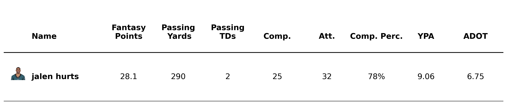
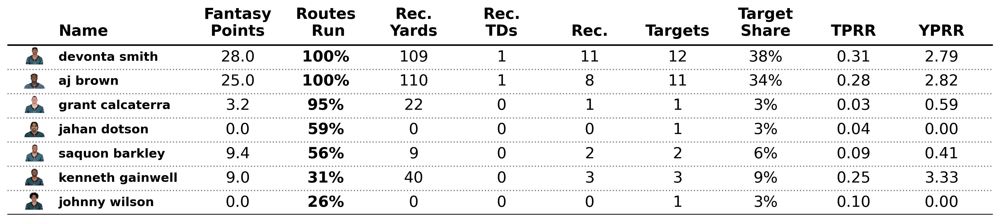
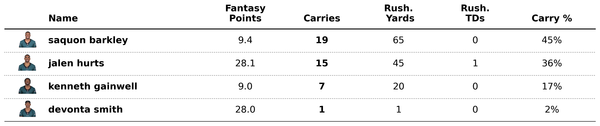

# Fantasy Football Weekly Summaries 
## Intro

I enjoy playing fantasy football. Of course, many people do. The freedom and thrill associated with trying to assemble a superteam from NFL stars that you get to watch every week is great.

Unfortunately (or maybe fortunately? :thinking:) the fantasy performance of many players can be skewed by touchdowns (or in general, outlier performances e.g. multi td games, games with two catches each 60+yards and for tds); while these performances are great, and in general happen more often for good players, they are not (in my opinion) the metrics we should be chasing when determining which players are good, elite, etc (partially due to do the infrequency(?) of TDs). Better metrics include target share for WRs (and RBs), and Yards/Attempt and TD Rate for QBs. The discrepancy between stats that the masses think are important and those that are actually important is crucial to gaining an edge in this very random game (although admittedly, I have a very poor record in most of my leagues, but I maintain that knowing which players are good is a very different thing than acquiring said players from leaguemates).

I won't try to convince anyone of that here (but I would like to shout out the likes of [Drew](https://x.com/DFBeanCounter), [Coop](https://x.com/coopsfb?lang=en), and [Adeiko](https://x.com/adeiko_ff?lang=en) for opening my eyes to the analytics behind fantasy football). Perhaps later on I'll try to express why these stats are the "stats that matter", but for now I'd just like to share some of the projects I'm working on.

## Fantasy Football Weekly Summaries

The code presented in this repo represent a script that I run essentially every week following football sunday as a summary for myself so I can see the performance of every relevant (and some non relevenat) fantasy players. There were a few weeks where I tried to share the outputted charts on my twitter, but uploading 3 charts for ~32 teams every week was too tall a task for the time committment.

The script aggregates relevant metrics from [nfl_data_py](https://github.com/nflverse/nfl_data_py), [PFF](https://www.pff.com/), and [NGS](https://nextgenstats.nfl.com/). Of course, not all the metrics I would like to output are immediately available, so some Pandas operations are needed to extract the more meaningful information. 

The notebook included here shows me importing the relevant information from different sources, and then running three different plotting functions to plot performances for passing, receiving, and rushing (in this case the charts show performances for the 2024 Eagles in Week 15).

The .py file showcases relevant functions I've written to perform my Pandas operations, plotting, etc. Of note:
- weekly_recap: where the bulk of the pandas operations occur. Dataframes are seperated by position
- plot_pass/rec/rush_recap: plotting functions. some cleanup is performed to make values more chart friendly. There was a resource I looked into a while ago (a webpage/article title "Beautiful Tables") that has since been deleted, but most of the plotting here was inspired from there.

## Specifics on the charts

Figured I'd share a little on why I choose to share what I do share on these charts. Starting with passing:  

All these charts start with that week's fantasy points. Pass Yards and TDs shouldn't be suprising. Comp % and YPA are pretty important (correlated with good performances/QBs that perform highly over the years), so I look at those often. ADOT isn't very correlated with performance, so in my next iterations I'll remove it, and likely replace it with PFF's Offensive and Passing Grades.

Receiving stats are the most fun to look at. I have routes run in bold, as it's the best way to determine what WRs the coaches consider as "starters" (looking at RR is also how I found out to my horror that Diontae Johnson wasn't getting any playing time on any of his teams following his departure from Carolina this past season, and that Marc Andrews was almost never playing full games). Aside from the usual box score stats, Target Share is what I really love to look at (WRs with ~27%TS are the difference makers - in this particular game both AJB and DeVonta had great games). The targets and yards per route run are normalized stats that I like to look at too.

The rushing charts are pretty self-explanatory. I can't say that % of carries has shown me anything outrageous - if the RB has 15+ you can already guess they have a large share of the carries. This chart is pretty useful for seeing which QBs are running, however.

